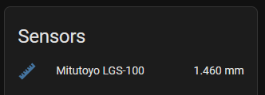
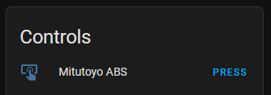
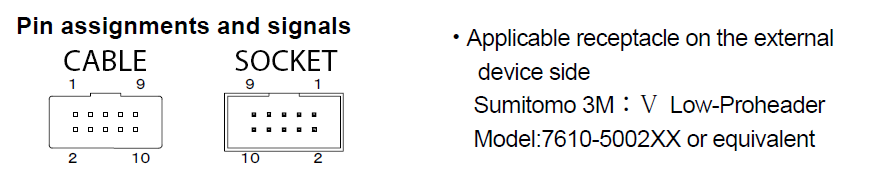
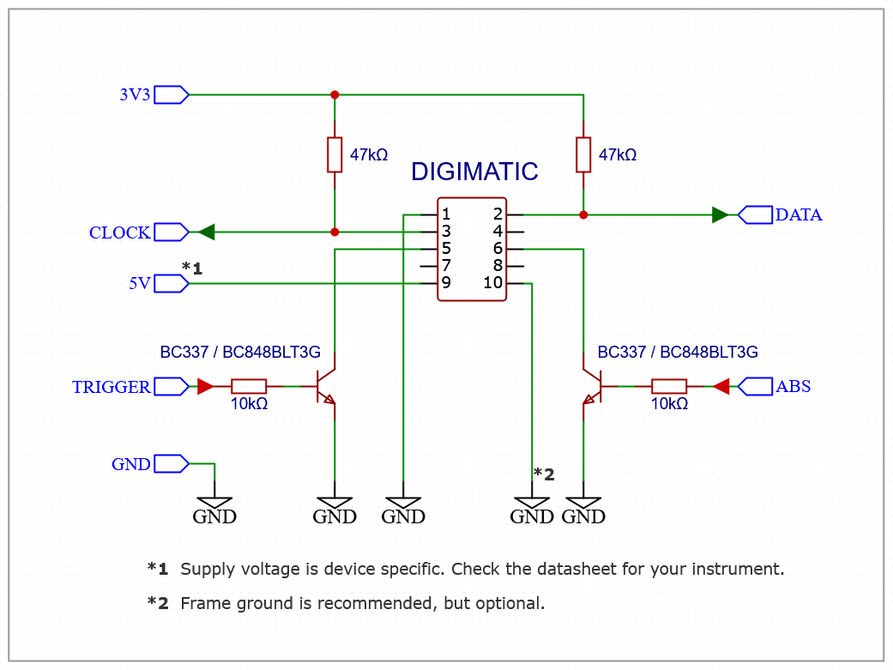

Mitutoyo Digimatic Instrument Sensor
==============================================

.. seo::
    :description: Instructions for setting up Mitutoyo Digimatic Instrument sensor readings
    :image: mitutoyo_digimatic.jpg

The ``mitutoyo`` sensor platform allows you to use your Mitutoyo Digimatic (linear gauge, caliper, micrometer) instruments or any Digimatic SPC compatible clone/OEM instrument for data logging with ESPHome.

.. code-block:: yaml

    # Example configuration entry
    sensor:
      - platform: mitutoyo
        name: "Mitutoyo LGS-100"
        id: mitutoyo_gauge
        clock_pin: 36
        data_pin: 18
        trigger_pin: 26
        reversed: true
        accuracy_decimals: 2        
        update_interval: 10s

Configuration variables:
------------------------

- **mitutoyo** (**Required**): The information for the Mitutoyo Digimatic sensor.

  - **name** (**Required**, string): The name for the Mitutoyo Digimatic sensor.
  - **id** (*Optional*, :ref:`config-id`): Set the ID of this sensor for use in lambdas. Required for being able to set the ABSOLUTE point in zeroing the instrument
  - **clock_pin** (**Required**, number): The input pin for the CLK signal from the instrument. The signal is ``active-low`` (ref. "Typical wiring" below)
  - **data_pin** (**Required**, number): The input  pin for the DATA signal from the instrument. The signal is ``active-low`` (ref. "Typical wiring" below)
  - **trigger_pin** (**Required**, number): The output pin for the REQ signal from the instrument. The signal is ``active-low`` (ref. "Typical wiring" below)
  - **reversed** (*Optional*, boolean): Set if the direction of the expected reading is in reverse. This flips the sign of the measured values.
  - All other options from :ref:`Sensor <config-sensor>`.

Advanced use:
--------------------

Some Mitutoyo Digimatic sensors will offer possibility of setting an arbitrary absolute point **ABS** and use it as an origin for further measurements. This is achieved by using an additional configuration as shown here:

.. code-block:: yaml

    # Example configuration entry
    sensor:
      - platform: mitutoyo
        name: "Mitutoyo LGS-100"
        id: mitutoyo_gauge
        .....
        
    output:
      - platform: gpio
        id: mitutoyo_abs
        pin:
          mode: output
          number: 19

    button:
      - platform: template
        name: Mitutoyo ABS
        on_press:
          - lambda: id(mitutoyo_gauge).disable_polling();
          - output.turn_on: mitutoyo_abs
          - delay: 1600ms
          - output.turn_off: mitutoyo_abs
          - delay: 400ms
          - lambda: id(mitutoyo_gauge).enable_polling();

Typical wiring:
--------------------

The common Digimatic D2 connector is a standard 2x5 IDC connector with a notch and has the following pin numbering:

For stability CLK (clock_pin) and DATA (data_pin) lines of the instrument could be pulled to VCC using 10k-47k resistors;
The output pins REQ (trigger_pin) and ABS (the pin on the output component) need to use an open-collector switch.

Please note that most Mitutoyo Digimatic instruments **do not** support getting powered via the Digimatic cable. Refer to the User Manual matching your actual instrument before wiring. For battery powered units, the pin 9 on the Mitutoyo Digimatic D2 cable can be left not-connected

See Also
--------

- :ref:`sensor-filters`
- :doc:`dht`
- :ghedit:`Edit`
